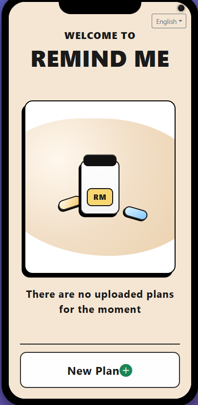
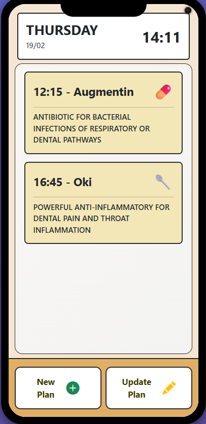
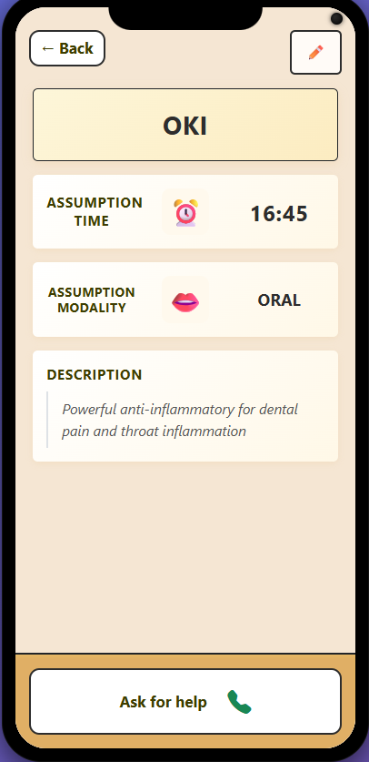
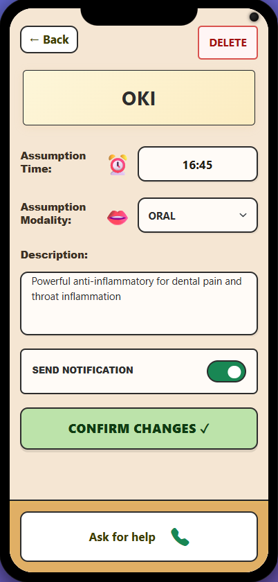

## Project Overview

This project presents **Remind-Me**, a prototype application designed to support people in managing their medication routines.

The core goal is to help users remember when and how to take medicines, while also considering potential **mobility difficulties** that can affect daily medication management.

The project is the final outcome of a **semester-long Human-Computer Interaction (HCI) process**. During this process, we investigated the deeper needs of our target users—especially **elderly people**—and translated those insights into a human-centered design proposal.

This repository contains a **prototype**, not a production-ready mobile app. For this reason, the implementation is intentionally lightweight and built with JavaScript and React based rather than native mobile technologies. The objective is to communicate the interaction model and user experience concept, not to deliver a final commercial product.

In short, this prototype demonstrates how an HCI-centered approach can guide the design of accessible and meaningful medication reminder experiences.

## Features

- Possibility to check the current medication assumption plan.
- Possibility to change the weekly assumption plan according to mobility constraints.
- Possibility to create a new plan.

## Prototype Screenshots

<table>
  <tr>
    <td align="center" width="50%">
      
      <p><em>Start Screen</em></p>
    </td>
    <td align="center" width="50%">
      
      <p><em>Home Page Screen</em></p>
    </td>
  </tr>
  <tr>
    <td align="center" width="50%">
      
      <p><em>Personalization Screen</em></p>
    </td>
    <td align="center" width="50%">
      
      <p><em>Medicine Details Screen</em></p>
    </td>
  </tr>
  <tr>
    <td align="center" width="50%">
      
      <p><em>Modify Medicine Screen</em></p>
    </td>
    <td align="center" width="50%">
    </td>
  </tr>
</table>

## Setup and Run

Before starting the application, install dependencies in both the client and server directories.

### 1) Install packages

From the project root:

```bash
cd client/remind-me
npm install

cd ../../server
npm install
```

### 2) Run the client

In `client/remind-me`:

```bash
npm run dev
```

### 3) Run the server

In `server`:
```bash
node index.mjs
```

### 4) Expose the client for mobile testing (ngrok)

With the client already running, open another terminal in `client/remind-me` and run:

```bash
npm run tunnel
```

This creates an ngrok tunnel so the prototype can be reached from a mobile device.

## DB Entities

### Medicine
- name
- assumption_modality
- medicine_type (pill, sachet, drops)
- description 

### Plan (weekly)
- creation_date
- time_slots
- motivations

### ScheduledMedicine (Plan-Medicine relationship table)
- id_medicine
- id_plan
- assumption_day
- assumption_time


## API

### **Get all the medicines of a plan**

URL: `/api/plans/<id>/scheduled-medicines`

HTTP Method: GET.

Query params: `day` (optional) - e.g. `?day=Monday`

Description: Retrieve all the medicines involved in the plan represented by `<id>`.

Responses:
- `200 OK` — JSON array of medicine entries (each includes `id`, `name`, `description`, `assumption_modality`, `medicine_type`, `assumption_day`, `assumption_time`)
- `404 Not Found` — invalid plan `id`

Response body (example unfiltered):
```json
[
  {
    "id_medicine": 1,
    "id_scheduled_medicine": 1,
    "name": "Tachipirina",
    "description": "medicine for the headache",
    "assumption_modality": "oral",
    "medicine_type": "pill",
    "assumption_day": "Monday",
    "assumption_time": "8:30"
  },

  {
    "id_medicine": 1,
    "id_scheduled_medicine": 2,
    "name": "Tachipirina",
    "description": "medicine for the headache",
    "assumption_modality": "oral",
    "medicine_type": "pill",
    "assumption_day": "Friday",
    "assumption_time": "9:30"
  },

  ...

]
```

### **Update medicine information**

URL: `/api/plans/<id_plan>/scheduled-medicines/<id_scheuled_medicine>`

HTTP Method: PUT.

Description: Update the information related to the instance of the medicine represented by `<id_scheduled_medicine>` of the plan represented by `<id_plan>`.

Request body:
```json
{
  "description": "medicine for the headache",
  "assumption_modality": "oral",
  "medicine_type": "pill",
  "assumption_time": "8:30"
}
```

Responses:
- `200 OK` — success
- `404 Not Found` — invalid plan or medicine_schedule `id`


### **Delete the medicine schedule**

URL: `/api/plans/<id_plan>/scheduled-medicines/<id_scheduled_medicine>`

HTTP Method: DELETE.

Description: Delete the instance of the medicine represented by `<id_medicine_schedule>` of the plan represented by `<id_plan>`.


Responses:
- `204 No content` — success
- `404 Not Found` — invalid plan or scheduled_medicine `id`


### **Check for pending notifications**

URL: `/api/notifications/check`

HTTP Method: GET.

Query params: None.

Description: Checks if there is a pending notification to be displayed on the client. This endpoint is primarily used for the prototype's polling mechanism to simulate server-side push notifications. If the manual trigger has been activated on the server, this returns a positive status.

Responses:
- `200 OK` — JSON object containing the status (`yes` or `no`) and the message (name) if a notification exists.
- `500 Internal Server Error` — Generic server error.

Response body (example - Notification pending):
```json
{
  "status": "yes",
  "message": "TACHIPIRINA"
}